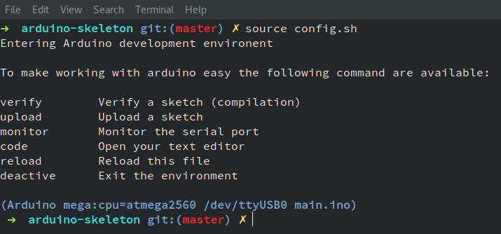
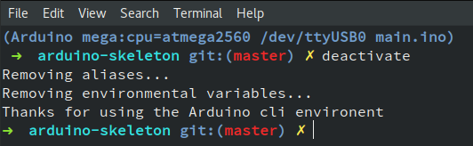

# Arduino IDE project skeleton

If you like Arduino, but also like to use your text editor of choice and you're not afraid of the command line, this project is for you! Like many others I started programming micro-controllers using the Arduino IDE. But after a while I started to dislike the default editor. For a while I used an Arduino Makefile to compile my code. Until recently I found out that the current version (as of May 2016) of the Arduino IDE also has a command line interface. (See [documentation](https://github.com/arduino/Arduino/blob/master/build/shared/manpage.adoc))

# Dependencies

* Arduino IDE >= 1.5
* bash or zsh
* minicom     (optional)
* git         (optional)

# Usage

To get started clone this repo or download zip and extract on your local machine. To clone using git:

```shell
$ git clone https://github.com/bremme/arduino-project-skeleton
```

Open the `config.sh` file and set the location of your Arduino binary, serial port, serial speed, Arduino board and optionally a serial monitor program and editor. When done source the `config.sh` file to load the configuration.

```shell
$ source config.sh
```



The configuration file adds several environmental variables and aliases for verifying (compiling), uploading (compile and flash) and running a serial monitor.

To verify your sketch run:

```shell
$ verify
```

To upload your sketch run:

```shell
$ upload
```

When you are done working on your project, you can deactivate the environment by:

```shell
$ deactivate
```



> If your wondering what shell I'm using: gnome-terminal (emulator), zsh (shell), oh my zsh! (plugin framework)

# Structure

The structure of your new Arduino project is as follows:

```shell
.
├── doc                 Aditional documentation file
├── libraries           Arduino library files
├── main                Main sketch file
│   └── main.ino        Main Arduino sketch
├── LICENCE.txt         Licence file
├── config.sh           Arduino config file
└── README.md           Project README file
```

You (main) sketch goes in `main/main.ino`. This is where `void setup()` and `void loop()` live. Your libraries (dependencies) go into the libraries folder. You can ether copy your libraries here or symlink them. If you have additional documentation, like datasheets for example, they go into the `doc` folder.
